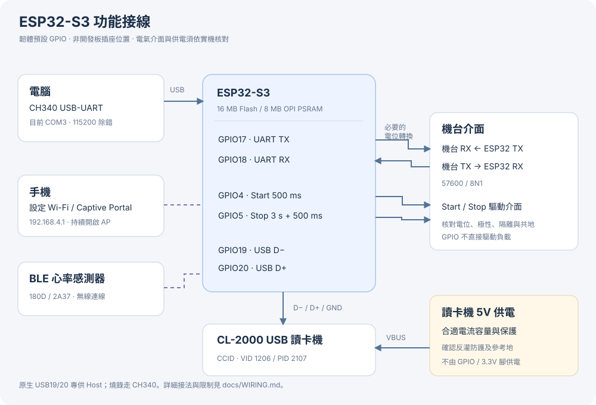
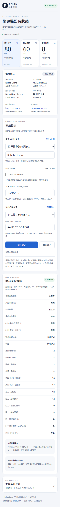

# Rehab ESP32

將既有 Raspberry Pi 復健機控制程式移植至 **ESP32-S3**，整合 BLE 心率、機台 UART／GPIO、TCP 與 SYNNIX CL-2000 USB 讀卡機。手機可連入裝置的設定 Wi-Fi，或在同一區域網路開啟裝置 IP，設定連線並查看即時除錯資訊。

本專案由 `20260701_C521M/pi/HeartBeatRate/multi_thread.py.20260910` 的行為移植而來。原檔保留於使用者工作目錄，不納入此獨立專案；來源 SHA-256 與協定差異見 [通訊協定](docs/PROTOCOL.md)。

> 本專案的實測範圍以 [驗證紀錄](docs/VALIDATION.md) 為準。韌體能編譯或模擬測試通過，不代表實際機台、CL-2000、心率感測器及所有手機已完成驗收。

## 功能

- **持續開啟設定熱點**：`RehabSetup_AA:AA:AA:AA:AA:AA`，後綴使用各裝置自己的 AP MAC，大寫並保留冒號。熱點無密碼，STA 連線成功或失敗都不關閉。
- **手機 Captive Portal**：連入熱點後由手機系統提示設定頁；亦可手動開啟 [http://192.168.4.1/](http://192.168.4.1/)。網頁資源完全離線，繁體中文、手機 RWD。
- **同區網完整設定**：ESP32連上目標Wi-Fi後，可從同一區域網路開啟 `http://<裝置的STA-IP>/`，使用完整頁面與API。連線概況提供可點擊的熱點／區網入口。
- **連線設定**：搜尋或輸入 Wi-Fi SSID、設定密碼、TCP 主機及 BLE 心率 MAC。藍牙選單顯示裝置名稱、位址與訊號。
- **即時除錯**：BLE 心率、RPM、阻力、機台心率、運動時間、距離／熱量／功率／扭力原始值、狀態查詢、最後封包、USB／BLE／網路狀態與錯誤計數。
- **原通訊相容**：維持 TCP client 9999 埠、原二進位封包與 checksum；機台 UART 57600／8N1，保留啟停脈衝與暫停命令僅回覆的行為。
- **設定持久化**：只保存連線設定至 NVS。運動中修改先保存，停止流程及必要通訊完成後套用；重新開機使用最新保存設定。
- **不保存運動紀錄**：讀值、UID、最後封包及診斷計數只存在 RAM；重新開機清除。分割區不包含運動紀錄檔案系統、OTA 或 core dump。

## 硬體需求

| 項目 | 需求／用途 |
|---|---|
| 控制板 | ESP32-S3，16 MB Flash、8 MB OPI PSRAM；目前連接的板子以 COM3 的 CH340 USB-UART 介面燒錄 |
| 機台 | 與原程式相容的 UART 通訊及 Start／Stop 控制介面 |
| 心率裝置 | BLE Heart Rate Service `180D`／Heart Rate Measurement `2A37`；電池服務非必要 |
| 讀卡機 | SYNNIX CL-2000，USB VID `1206`、PID `2107`，相容的 CCID APDU 介面 |
| 網路 | 2.4 GHz Wi-Fi；目標 TCP 伺服器可從此網路連入，監聽9999埠 |
| USB Host 配線 | 原生 USB D−／D+、適當的5V讀卡機供電與對應連接器 |
| 電氣介面 | 依實際機台提供電位轉換／隔離／啟停驅動；不能假定機台訊號是3.3V TTL |

GPIO 數字是 **ESP32 GPIO 編號**，不是開發板排針序號，也不是原 Raspberry Pi 實體腳位。不同開發板的 USB 插座、5V路徑與電源切換設計不同；應依該板原理圖確認。

## 腳位連接

以下為韌體預設，集中在 [`board_config.h`](firmware/RehabEsp32/src/board_config.h)。目前是否完成實機接線，另見驗證紀錄。

| 功能 | ESP32-S3 腳位／介面 | 連接對象與要求 |
|---|---|---|
| 機台 UART TX | GPIO17 | 接機台 RX，必要時經電位轉換／隔離 |
| 機台 UART RX | GPIO18 | 接機台 TX；輸入不得超出 ESP32 的電氣規格 |
| 啟動訊號 | GPIO4 | 接既有 Start 驅動介面；HIGH 500 ms |
| 停止訊號 | GPIO5 | 接既有 Stop 驅動介面；HIGH 3秒後 LOW，再等待500 ms |
| USB Host D− | GPIO19 | 接 CL-2000 USB D−；使用適當 USB 配線 |
| USB Host D+ | GPIO20 | 接 CL-2000 USB D+；使用適當 USB 配線 |
| USB Host VBUS | 經適當保護的5V | 供電給讀卡機；不由 GPIO／3.3V 腳位供電，避免反向供電至電腦或板子 |
| GND | GND | 非隔離介面連接對應訊號地；隔離方案依其設計處理 |
| 燒錄／除錯 | CH340 USB-UART | 接電腦，序列監看115200；與讀卡機原生 USB Host 路徑分開 |



**不要將 GPIO 直接接到馬達、繼電器線圈、RS-232 正負電壓或未知的5V／12V機台訊號。**圖中方框表示需要核對的介面，不指定未驗證的驅動電路。原生 GPIO19／20 已供 USB Host 使用，不可同時啟用原生 USB CDC／MSC／DFU。詳細供電與接線程序見 [WIRING.md](docs/WIRING.md)。

## 快速開始

### 1. 安裝固定工具鏈

使用 **PowerShell 7**。安裝 [Arduino CLI 1.5.1](https://github.com/arduino/arduino-cli/releases/tag/v1.5.1)、Python 3，並將工具加入 PATH。執行桌面測試另需支援 C++17 的 `g++`／`clang++` 及 Node.js 20以上。

```powershell
git clone https://github.com/root50643/rehab_esp32.git
cd rehab_esp32
arduino-cli version
python --version
arduino-cli core update-index --additional-urls https://espressif.github.io/arduino-esp32/package_esp32_index.json
arduino-cli core install esp32:esp32@3.3.11 --additional-urls https://espressif.github.io/arduino-esp32/package_esp32_index.json
```

`toolchain.json` 是板型與版本的來源，完整 FQBN：

```text
esp32:esp32:esp32s3:FlashMode=qio,FlashSize=16M,PSRAM=opi,USBMode=default,CDCOnBoot=default,MSCOnBoot=default,DFUOnBoot=default,UploadMode=default,PartitionScheme=custom
```

使用 core 內附 Wi-Fi／WebServer／BLE／Preferences、NimBLE 底層及 ESP-IDF USB Host API，不另安裝名稱相似的 BLE 函式庫。

實體Flash為16 MB，**factory應用程式分割區為4 MiB**。Arduino CLI若顯示16 MB最大程式容量，仍須以本專案 `partitions.csv` 的4 MiB上限判斷，詳見編譯文件。

NVS位於 `0x9000`、大小20 KiB；`0xE000–0xFFFF` 保留給Arduino上傳配方，應用程式從 `0x10000` 開始。PHY初始化資料由核心內建，不另設PHY或core dump分割區。

### 2. 執行測試並編譯

```powershell
python tools/run_tests.py
.\tools\build.ps1
```

首次可用 `.\tools\build.ps1 -InstallCore` 安裝指定核心。工具未在 PATH 時，可使用 `-ArduinoCli '完整路徑\arduino-cli.exe'`、`-Python '完整路徑\python.exe'`。腳本將編譯暫存放在ASCII路徑，避免Windows linker不接受中文路徑的限制，成功產物複製到 `build/artifacts/`。網頁會先由 `tools/embed_web.py` 轉成 C++ 資源，因此修改網頁後要重新編譯、燒錄。

### 3. 備份後燒錄

先關閉佔用 COM3 的序列監看程式，執行 `arduino-cli board list` 確認實際連接埠。**首次覆寫前讀回完整原 Flash**，保存於已被 Git 忽略的 `backups/`，並記錄 SHA-256；步驟與還原方式見 [BUILD_AND_FLASH.md](docs/BUILD_AND_FLASH.md#備份原-flash)。

```powershell
.\tools\flash.ps1 -Port COM3
.\tools\monitor.ps1 -Port COM3
```

`flash.ps1` 使用已編譯產物，不會替你備份原韌體。開機序列訊息會列出版本、實際 AP 名稱及設定網址。COM3 僅是目前電腦的識別碼，換電腦或 USB 孔後需重新確認。

### 4. 以手機完成設定

1. 連入 `RehabSetup_<AP MAC>`，選擇保持連線；設定熱點沒有密碼，也不提供手機上網轉送。
2. 開啟系統提示的設定頁。沒有提示時，用瀏覽器輸入 **http://192.168.4.1/**，注意不是 HTTPS。
3. 按「搜尋 Wi-Fi」，選擇2.4 GHz目標網路，或手動輸入隱藏 SSID。
4. 勾選「更改 Wi-Fi 密碼」並填入新密碼。若網路確實無密碼，明確選「無密碼網路」；未勾選時保留既有密碼。
5. 填入 TCP 主機，例如 `192.168.0.100`，不加 `http://` 或 `:9999`。
6. 按「搜尋藍牙」，選擇名稱與 MAC 相符的心率裝置，或手動輸入 MAC。預設尚未設定；留白停用心率連線。
7. 按「儲存設定」，查看連線概況與即時數值。運動中會顯示「等待套用」，停止流程完成後才切換。
8. STA成功連線後，連線概況會顯示「區域網路入口」。手機／電腦連到同一區域網路，即可透過該HTTP網址再次開啟完整設定頁，不必一直留在設定熱點。

AP 與 STA 共用無線電／頻道，切換目標 Wi-Fi 可能令手機短暫重連；AP 模式仍保持啟用。Captive Portal 是否自動彈出由手機系統決定，手動網址始終是備援入口。詳細規則見 [設定說明](docs/CONFIGURATION.md)。

區網入口使用路由器配發的STA IP；可由設定頁、路由器的DHCP用戶端清單，或115200序列監看的STA連線訊息查詢。透過區網更改SSID／密碼後，裝置可能離開原網路或取得新IP，使目前頁面中斷；請查詢新IP，或回到持續開啟的設定熱點。頁面不會因IP更新覆蓋尚未儲存的表單，入口連結在新分頁開啟。

## 如何讀取除錯頁

頁面約每1秒讀取一次狀態；慢請求不重疊，切換到背景時暫停，返回後重新更新。刷新不覆蓋尚未儲存的表單。頁面沒有啟停或調整阻力的操作按鈕。

| 畫面／資料 | 說明 |
|---|---|
| BLE 心率 | 來自 `180D/2A37`，與機台回報心率分開；三筆有效通知後就緒，10秒未收到有效通知會失效並重連 |
| 轉速 RPM | 機台 `0x28` 回報；0x28資料5秒未更新即標示過期 |
| 實際阻力 | 機台 `0x3F` 回報；與主機要求、已送出指令分開，使用0x3F自己的更新時間 |
| 機台其他數值 | 分／秒、機台心率、距離、熱量、兩組功率與扭力；未知換算比例保留「原始值」 |
| 狀態查詢 | 查看最近 TCP `0x20` 查詢與實際送出的回覆，確認主機問了什麼、裝置如何回覆 |
| 進階通訊資訊 | Wi-Fi／TCP／BLE／USB 狀態、GPIO 脈衝、TCP／UART待送佇列與等待ACK、ATR、APDU 狀態字、最後 RX／TX HEX 與錯誤計數 |
| `—`／過期 | `—` 表示尚未收到，不等同0；過期值只能供追查，不能視為目前值 |

「TCP 已寫入」、「收到主機回覆」及「機台回報」是三件不同的事。`0x23` 數值回報不等待 ACK；阻力 `0x25` 的 TCP 回覆表示已收命令，並非機台已實際變更。完整欄位對照見 [DEBUGGING.md](docs/DEBUGGING.md)。

以下是實際介面搭配 `tests/fixtures/status.json` 人工資料的截圖，不是現場心率或卡片紀錄：



[查看桌面版進階診斷截圖](docs/images/diagnostics-desktop.png)。

## 保存與存取範圍

只將 SSID、密碼、TCP 主機、BLE MAC 與設定版本保存於 NVS。GET API 不回傳密碼；未指定變更密碼不會清空。使用版本號避免多個手機頁面互相覆蓋，版本衝突回傳 HTTP 409 並保留前端輸入。

設定AP是開放網路，**可連入設定熱點，或可在同區網連到裝置STA IP的人，都能查看即時除錯資訊與修改設定**。兩個入口具有相同功能，本版本沒有登入、TLS或NVS加密；Captive DNS只作用於設定AP，不攔截區網DNS。匯出截圖／測試資料前先移除真實卡號、現場網路名稱與個人讀值。

## 專案結構

```text
rehab_esp32/
├── README.md / CHANGELOG.md / CONTRIBUTING.md
├── toolchain.json                 # 固定版本及完整板型參數
├── firmware/RehabEsp32/
│   ├── RehabEsp32.ino             # 啟動各服務
│   ├── partitions.csv             # NVS + factory app，無運動資料檔案系統
│   └── src/                       # 機台、TCP、BLE、CCID、設定與 Portal
├── web/                          # 可維護的 HTML / CSS / JavaScript 原始碼
├── tools/                        # 建置、燒錄、監看、網頁嵌入與測試
├── tests/                        # C++ 協定測試及 Node 前端測試
├── docs/                         # 接線、設定、協定、驗證及維護文件
└── .github/                      # CI、Issue 與 PR 範本
```

`build/`、`backups/`、`local/`、`artifacts/` 與產生的 `web_assets.h` 不納入版本控制。原 Raspberry Pi 目錄、APK、壓縮檔、系統備份及現場資料不屬於此儲存庫。

## 文件索引

| 文件 | 內容 |
|---|---|
| [接線與供電](docs/WIRING.md) | 接腳、電氣介面、USB Host 與燒錄路徑 |
| [編譯與燒錄](docs/BUILD_AND_FLASH.md) | 工具版本、備份、建置、燒錄、還原 |
| [手機設定](docs/CONFIGURATION.md) | 掃描、手填、密碼保留、延後套用、API |
| [即時除錯](docs/DEBUGGING.md) | 讀值來源、時效、封包與診斷欄位 |
| [通訊協定](docs/PROTOCOL.md) | TCP／UART／BLE／CCID、來源與相容差異 |
| [程式架構](docs/ARCHITECTURE.md) | FreeRTOS工作、狀態快照、掃描與設定流程 |
| [驗證紀錄](docs/VALIDATION.md) | 已完成的測試、待實測項目、驗收程序 |
| [故障排除](docs/TROUBLESHOOTING.md) | 依症狀找出連線、接線及讀值問題 |

## 維護、發布與授權

修改方式與測試要求見 [CONTRIBUTING.md](CONTRIBUTING.md)，版本變更見 [CHANGELOG.md](CHANGELOG.md)。CI 執行可攜協定測試、Node／Chromium前端測試與固定核心的韌體編譯，不取代實體硬體驗收。

專案儲存庫：[root50643/rehab_esp32](https://github.com/root50643/rehab_esp32)。私人儲存庫需使用具有存取權限的GitHub帳號下載。GitHub Actions執行桌面測試與固定版本韌體編譯；實體設備的驗證範圍另見 [VALIDATION.md](docs/VALIDATION.md)。發布Release或改變儲存庫可見性，由擁有者另行決定。

目前 **尚未指定本專案的開源授權**，因此未加入 LICENSE；底層 SDK／工具依各自授權提供。既有控制程式的使用與發布權限由專案擁有者確認。
