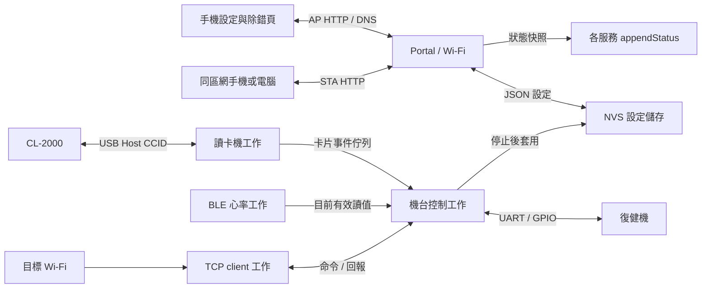
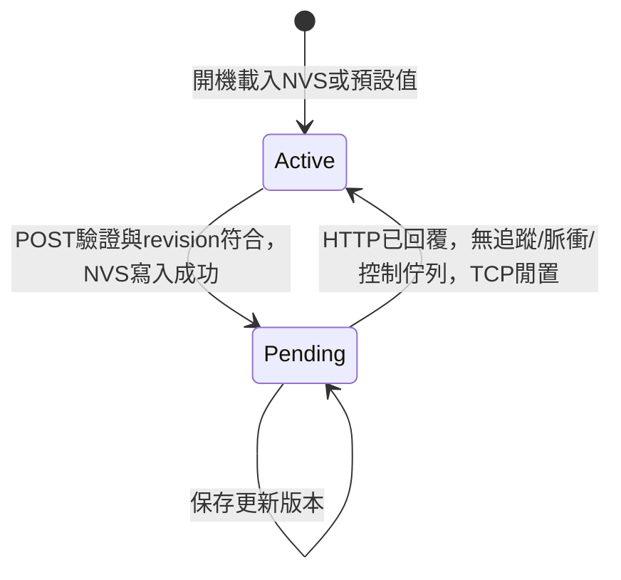

# 程式架構

## 模組與資料流

| 模組 | 責任 |
|---|---|
| `RehabEsp32.ino` | 設定載入、服務啟動、Portal主迴圈 |
| `portal` | AP＋STA、DNS、HTTP、Wi-Fi掃描、離線網頁與API |
| `settings`／`settings_validation` | 設定驗證、revision衝突、NVS、保存值與生效值 |
| `controller`／`protocol` | TCP控制命令、UART解析、GPIO時間狀態機、數值回報、套用設定的時機 |
| `tcp_service` | client socket、優先回覆／一般輸出佇列、等待回覆、重連世代 |
| `ble_service`／`heart_rate_codec` | 有期限的NimBLE操作、候選掃描、GATT與心率解析 |
| `ccid_service`／`ccid_codec` | USB Host、描述元、CCID收送、APDU與卡片在場去重 |
| `web` | 手機表單、讀值與診斷展示，不提供機台控制按鈕 |

## 工作與同步

Portal由Arduino loop處理；機台、TCP、BLE及USB各自使用FreeRTOS工作／SDK回呼。UART與GPIO不以長時間delay執行脈衝。TCP的連線／DNS等待留在TCP工作，GATT及USB操作有期限，避免將所有I/O集中在Web請求中等待。

各服務以自己的mutex保護共享狀態。HTTP先取得服務快照，再編碼JSON；大型BLE掃描結果的JSON配置在釋放服務鎖後進行。這讓前端看到每個服務的一致資料，但整份回覆不是跨全部模組的單一原子交易。

TCP的連線generation把收送佇列與當前連線關聯，重連後丟棄舊工作。控制回覆具有優先佇列；一般事件使用另一個有界佇列，0x23每類只保留有效的最新待送值。數值在寫入socket前再次驗證，過期、被新值取代、斷線或已停止追蹤時取消，不排成運動歷史重播。USB卡片事件為有界佇列，離線時取出但不延後重放。

UART回覆使用有界FIFO，驅動緩衝可容納整個封包時才寫入，避免串列輸出阻塞GPIO時間處理。阻力新目標在上一筆等待ACK時合併為最新值，回覆或逾時後才下送。Start／Stop另有8筆控制佇列，完成脈衝的回覆需成功交給TCP後才執行下一筆控制。

## 設定狀態

NVS命名空間 `rehab`、key `settings`，資料包含magic、結構版本、設定與CRC。版本／長度／CRC／欄位驗證不符時使用預設設定。不是保存運動中間狀態的檢查點。

`saved`為最新保存值，`active`為目前生效值。POST成功回覆後至少等待500 ms再允許套用；controller確認無運動追蹤、脈衝、控制及UART回覆、待送阻力或阻力ACK，並確認TCP沒有收送、待送讀值或等待回覆。BLE位址改變只重設BLE；Wi-Fi憑證或TCP主機改變時通知相應服務重新連線。AP本身不關閉。重啟直接載入saved，不恢復脈衝或運動追蹤。

## 掃描協調

Wi-Fi掃描非同步進行，掃描啟動後最長15秒、最多保存32個SSID；同名SSID取訊號較強者，整體保留訊號較強的候選並排序。Portal要求Wi-Fi掃描時先禁止啟動新的BLE掃描，等待目前掃描完成；排隊與掃描啟動也有獨立期限，完成或錯誤後釋放。BLE使用同一個掃描器處理手動掃描與心率重連，候選上限64，不建立無限成長的廣播快取。

服務即使正在掃描仍可提供目前狀態。掃描不保證完全沒有無線傳輸延遲；共存、連線切換及真實感測器穩定性需實測。

## Web與API邊界

頁面原始碼位於 `web/`；建置時生成 `web_assets.h`，直接編入韌體，無外部字型、CDN或檔案系統。用 `textContent`呈現SSID、BLE名稱、錯誤與封包，避免把裝置廣播字串當成HTML。

HTTP監聽AP與STA，確認localIP為設定AP或目前已連線的STA IP；Host必須是實際接入介面IP（可附 `:80`），POST保留Origin檢查。Host不符的AP GET探測導向AP IP，STA請求拒絕，以限制DNS rebinding。兩個正常IP入口提供相同的頁面與API。DNS仍只綁定AP；AP未知非API路徑導向首頁，STA未知路徑回覆404。HTTP狀態使用no-store，網頁資源使用no-cache及只允許同源的Content Security Policy。這些限制不提供身分驗證：可連入AP或同區網STA入口的人都能設定與查看。

前端狀態輪詢與設定表單分開。修改密碼必須明確勾選；409保留使用者輸入。輪詢採單一未完成請求，背景頁停止，不將輪詢結果回寫成表單預設值。

前端從 `ap.ip` 與已連線狀態下的 `wifi.ip` 產生可點擊入口，只接受有效IPv4數字位址；未知／斷線清除連結。兩個連結開新分頁，API仍使用目前頁面的同源相對路徑，IP更新不自動導頁或丟棄編輯。

## 記憶體與儲存

目前數值、有效旗標、更新時間、最近封包與計數只在RAM。封包解析器、掃描候選與工作佇列有容量上限；網頁資源在Flash。NVS只保存設定，分割區不建立運動資料檔案系統或core dump。

Flash配置為 `0x9000` 起的20 KiB NVS，以及 `0x10000` 起的4 MiB factory app。`0xE000–0xFFFF`不列成分割區，保留給Arduino上傳配方寫入的8 KiB `boot_app0.bin`。core 3.3.11使用內建PHY初始化資料，無獨立 `phy_init` 分割區。

設定儲存是持久性寫入，不應由定時器每秒重複POST。快照讀取不寫入NVS。`free_heap`與`min_free_heap`可供長時間運行測試觀察，不能僅以一次開機值證明沒有記憶體問題。

## 測試分層

- 可攜C++標頭測試協定、BLE格式、CCID描述元／回覆、設定驗證與重要時間規則。
- Node測試執行純函式與表單事件的DOM/API harness，驗證密碼保留、409、輪詢及數值時效。
- Playwright以人工JSON快照驗證真正瀏覽器的版面、表單、掃描、XSS防護與過期呈現。
- ESP32編譯確認SDK介面與資源配置；實機測試確認無線電、USB、GPIO及電氣連接。

各層結果分開記錄於 [VALIDATION.md](VALIDATION.md)。
